<style>
slides > slide {
  overflow-x: auto !important;
  overflow-y: auto !important;
}
</style>

<style type="text/css">
slides > slide:not(.nobackground):after {
  content: '';
}
</style>

```{r setup, include=FALSE}
knitr::opts_chunk$set(echo = TRUE, fig.align="center", message = F, warning = F)
knitr::opts_chunk$set(dev.args = list(png = list(type = "cairo")))
library(igraph)
library(ggraph)
library(dplyr)
library(ggplot2)
library(tidygraph)
library(ggrepel)
library(purrr)
```

## What is Model Checking?
<center>
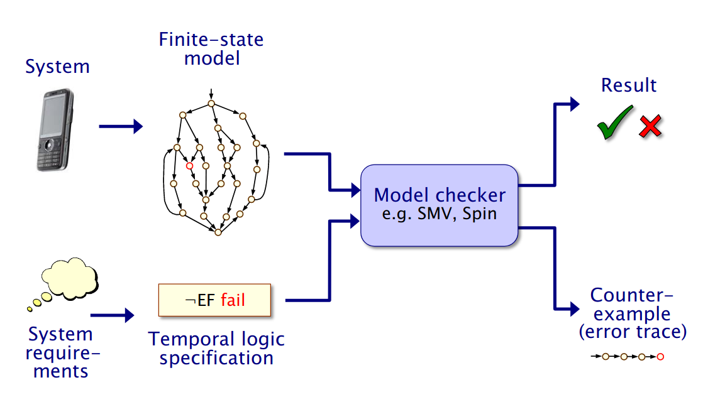{width=85%, position="center"}
</center>


## Similarities with classic Model Checking 

<center>
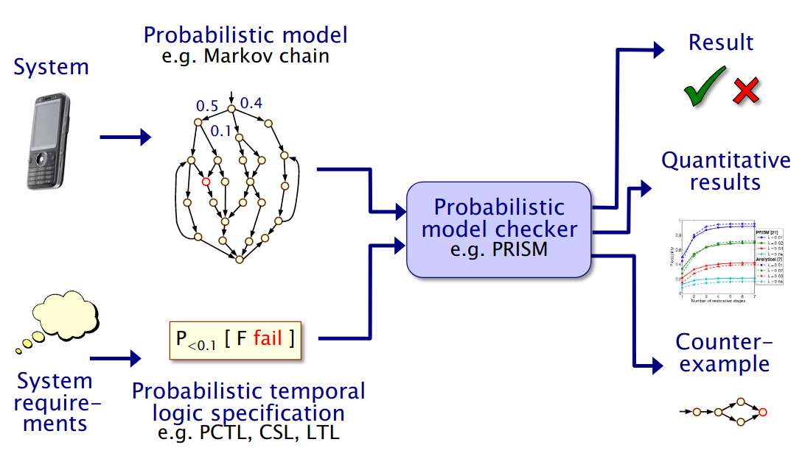{width=85%, position="center"}
</center>

## Why Probabilistic?

Many systems are naturally random and randomness allows higher level abstractions:

* Interactive systems
* Distributed systems
* Communication protocol
* Biological models

The analysis of probabilities and expected values permits to evaluate safety, reliability, resource usage and security.

## PRISM

Comprehensive tool for probabilistic model checking, other than a high level language form model definition and a flexible model
checking engine, this program provides a GUI and utilities for output visualization.

**Input**: Model (DTMC, CTMC, MDPs) + Specification (PCTL, CSL, LTL, PCTL*)  

**Processing**: 

  * Language interpretation and model construction 
  * Graph theory algorithms
  * Numeric computation algorithms (for linear system of equations resolution)
  * Automata theory algorithms (for example bisimulation minimization)
  * Statistical evaluation (sampling)

**Output**: 

  * **Qualitative**: Boolean (TRUE/FALSE)
  * **Quantitative**: Real (Probabilities or Quantities)

# Discrete Time Marov Chains (DTMCs)

## Probabilities and notation

This is a quick recap on fundamental aspects of probability theory:

* **Sample space** ($\Omega$): set of possible outcomes
* **Event** ($\omega \subseteq \Omega$): A subset of the sample space
* **Probability**: $P(\omega) = \frac{E_{fav}}{E_{tot}}$ 

**Example**: Getting head in a coin toss

* $\Omega = \{tail,head\}$
* $E = \{head\}$
* $P(E) = \frac{|E|}{|\Omega|} = \frac{1}{2}$

## DTMC definition

A DTMC is basically a **state transition system** augmented with probabilities

* $D_{DTMC} = (S, s_{init}, P, L)$
* $S$: set of states (nodes)
* $s_{init}$: initial state (can be generalized to an initial probability distribution)
* $P:(S \times S) \rightarrow [0,1]$: replaces transitions of Kripke structures, a transition is present when $P(s,s') > 0$.
* $L: S \rightarrow 2^{AP}$: Labeling function, associates to each state a set of **atomic propositions** (from the set $AP$)

<center>
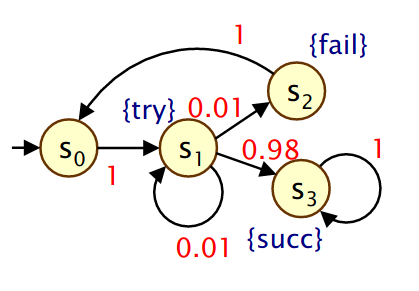
</center>


## DTMC definiton

$P$ represents weights on edges and is a stocastic matrix:

* sum of rows is one
* this means that the sum of the weights of outgoing edges from any node is one
* weights represent probabilities of taking a transition when in a specific state
  
<center>

</center>

## Time

In DTMC time can be either:

* **Homogeneous**: Time flow is constant and each tick implies a transition in the DTMC
* **Non-Homogeneous**: An external event implies a transition and so a time tick.

**Memoryless property**: 

 * Transition probabilities depend exclusively from the current state
 
 $$P(X(t) = s_k | X(k-1)=s_{k-1}, ..., X(0)=s_0) =$$
$$P(X(t) = s_k | X(k-1)=s_{k-1})$$
 

# Examples 


## Scheduler with prelation

**MODEL**:

<center>
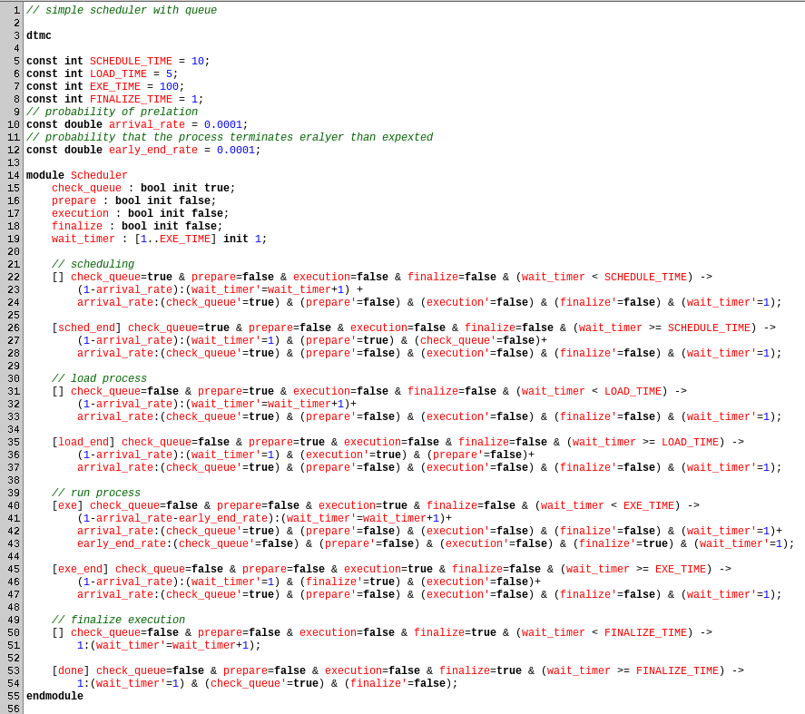
</center>

**GRAPH**:

<center>
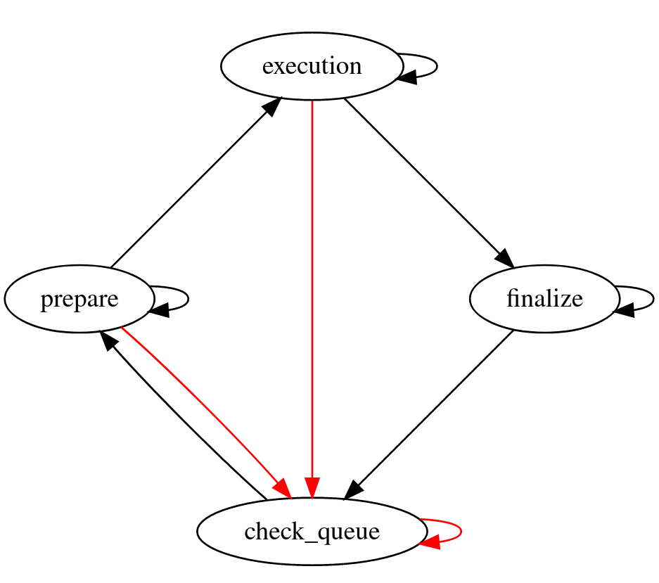{width=75%, position="center"}
</center>

**REWARDS**:

<center>
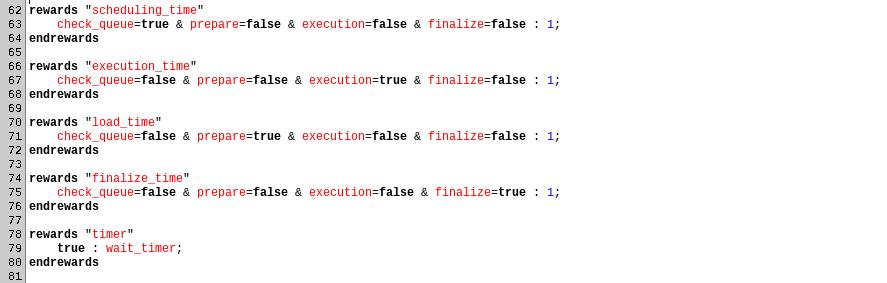
</center>

**PROPERTIES**:

<center>
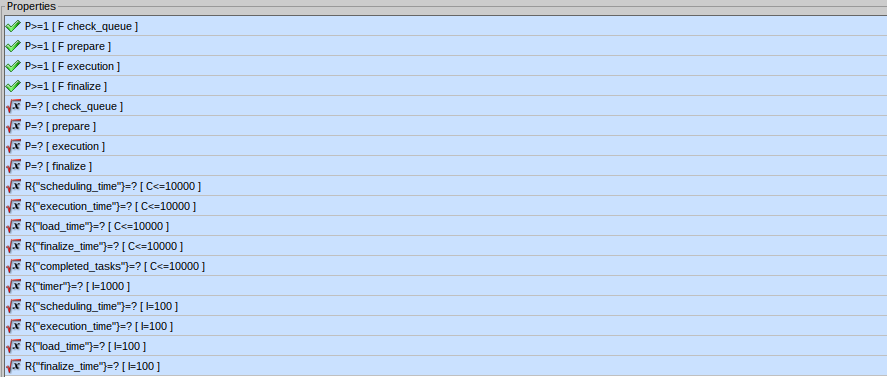
</center>

**RESULTS**:

```
PRISM
=====

Version: 4.6
Date: Mon Dec 21 16:48:45 CET 2020
Hostname: redsnic-MS-7760
Memory limits: cudd=1g, java(heap)=1g
Command line: prism Scheduler2.prism Scheduler2.props -maxiters 100000

Parsing model file "Scheduler2.prism"...

Type:        DTMC
Modules:     Scheduler 
Variables:   check_queue prepare execution finalize wait_timer 

Parsing properties file "Scheduler2.props"...

18 properties:
(1) P>=1 [ F check_queue ]
(2) P>=1 [ F prepare ]
(3) P>=1 [ F execution ]
(4) P>=1 [ F finalize ]
(5) S=? [ check_queue ]
(6) S=? [ prepare ]
(7) S=? [ execution ]
(8) S=? [ finalize ]
(9) R{"scheduling_time"}=? [ C<=10000 ]
(10) R{"execution_time"}=? [ C<=10000 ]
(11) R{"load_time"}=? [ C<=10000 ]
(12) R{"finalize_time"}=? [ C<=10000 ]
(13) R{"completed_tasks"}=? [ C<=10000 ]
(14) R{"timer"}=? [ I=1000 ]
(15) R{"scheduling_time"}=? [ I=100 ]
(16) R{"execution_time"}=? [ I=100 ]
(17) R{"load_time"}=? [ I=100 ]
(18) R{"finalize_time"}=? [ I=100 ]

---------------------------------------------------------------------

Model checking: P>=1 [ F check_queue ]

Building model...

Computing reachable states...

Reachability (BFS): 115 iterations in 0.01 seconds (average 0.000043, setup 0.00)

Time for model construction: 0.021 seconds.

Type:        DTMC
States:      117 (1 initial)
Transitions: 331

Transition matrix: 233 nodes (5 terminal), 331 minterms, vars: 11r/11c

Probability bound in formula is 0/1 so not computing exact probabilities...

Prob0: 3 iterations in 0.00 seconds (average 0.000000, setup 0.00)

Prob1: 1 iterations in 0.00 seconds (average 0.000000, setup 0.00)

yes = 117, no = 0, maybe = 0

Property satisfied in 1 of 1 initial states.

Time for model checking: 0.002 seconds.

Result: true (property satisfied in the initial state)

---------------------------------------------------------------------

Model checking: P>=1 [ F prepare ]

Probability bound in formula is 0/1 so not computing exact probabilities...

Prob0: 13 iterations in 0.00 seconds (average 0.000000, setup 0.00)

Prob1: 1 iterations in 0.00 seconds (average 0.000000, setup 0.00)

yes = 117, no = 0, maybe = 0

Property satisfied in 1 of 1 initial states.

Time for model checking: 0.001 seconds.

Result: true (property satisfied in the initial state)

---------------------------------------------------------------------

Model checking: P>=1 [ F execution ]

Probability bound in formula is 0/1 so not computing exact probabilities...

Prob0: 18 iterations in 0.00 seconds (average 0.000056, setup 0.00)

Prob1: 1 iterations in 0.00 seconds (average 0.000000, setup 0.00)

yes = 117, no = 0, maybe = 0

Property satisfied in 1 of 1 initial states.

Time for model checking: 0.0 seconds.

Result: true (property satisfied in the initial state)

---------------------------------------------------------------------

Model checking: P>=1 [ F finalize ]

Probability bound in formula is 0/1 so not computing exact probabilities...

Prob0: 17 iterations in 0.00 seconds (average 0.000000, setup 0.00)

Prob1: 1 iterations in 0.00 seconds (average 0.000000, setup 0.00)

yes = 117, no = 0, maybe = 0

Property satisfied in 1 of 1 initial states.

Time for model checking: 0.0 seconds.

Result: true (property satisfied in the initial state)

---------------------------------------------------------------------

Model checking: S=? [ check_queue ]

SCCs: 1, BSCCs: 1, non-BSCC states: 0
BSCC sizes: 1:117

Computing steady state probabilities for BSCC 1

Computing probabilities...
Engine: Hybrid

Building hybrid MTBDD matrix... [levels=11, nodes=262] [12.3 KB]
Adding explicit sparse matrices... [levels=11, num=1, compact] [1.4 KB]
Creating vector for diagonals... [dist=2, compact] [0.2 KB]
Allocating iteration vectors... [2 x 0.9 KB]
TOTAL: [15.8 KB]

Starting iterations...

Jacobi: 50896 iterations in 0.08 seconds (average 0.000002, setup 0.00)

BSCC 1 probability: 0.08629101644794694

All states are in BSCCs (so no reachability probabilities computed)

Value in the initial state: 0.08629101644794694

Time for model checking: 0.102 seconds.

Result: 0.08629101644794694 (value in the initial state)

---------------------------------------------------------------------

Model checking: S=? [ prepare ]

SCCs: 1, BSCCs: 1, non-BSCC states: 0
BSCC sizes: 1:117

Computing steady state probabilities for BSCC 1

Computing probabilities...
Engine: Hybrid

Building hybrid MTBDD matrix... [levels=11, nodes=262] [12.3 KB]
Adding explicit sparse matrices... [levels=11, num=1, compact] [1.4 KB]
Creating vector for diagonals... [dist=2, compact] [0.2 KB]
Allocating iteration vectors... [2 x 0.9 KB]
TOTAL: [15.8 KB]

Starting iterations...

Jacobi: 50896 iterations in 0.07 seconds (average 0.000001, setup 0.00)

BSCC 1 probability: 0.04311315497534009

All states are in BSCCs (so no reachability probabilities computed)

Value in the initial state: 0.04311315497534009

Time for model checking: 0.097 seconds.

Result: 0.04311315497534009 (value in the initial state)

---------------------------------------------------------------------

Model checking: S=? [ execution ]

SCCs: 1, BSCCs: 1, non-BSCC states: 0
BSCC sizes: 1:117

Computing steady state probabilities for BSCC 1

Computing probabilities...
Engine: Hybrid

Building hybrid MTBDD matrix... [levels=11, nodes=262] [12.3 KB]
Adding explicit sparse matrices... [levels=11, num=1, compact] [1.4 KB]
Creating vector for diagonals... [dist=2, compact] [0.2 KB]
Allocating iteration vectors... [2 x 0.9 KB]
TOTAL: [15.8 KB]

Starting iterations...

Jacobi: 50896 iterations in 0.07 seconds (average 0.000001, setup 0.00)

BSCC 1 probability: 0.8535264241489038

All states are in BSCCs (so no reachability probabilities computed)

Value in the initial state: 0.8535264241489038

Time for model checking: 0.095 seconds.

Result: 0.8535264241489038 (value in the initial state)

---------------------------------------------------------------------

Model checking: S=? [ finalize ]

SCCs: 1, BSCCs: 1, non-BSCC states: 0
BSCC sizes: 1:117

Computing steady state probabilities for BSCC 1

Computing probabilities...
Engine: Hybrid

Building hybrid MTBDD matrix... [levels=11, nodes=262] [12.3 KB]
Adding explicit sparse matrices... [levels=11, num=1, compact] [1.4 KB]
Creating vector for diagonals... [dist=2, compact] [0.2 KB]
Allocating iteration vectors... [2 x 0.9 KB]
TOTAL: [15.8 KB]

Starting iterations...

Jacobi: 50896 iterations in 0.07 seconds (average 0.000001, setup 0.00)

BSCC 1 probability: 0.017069404427808917

All states are in BSCCs (so no reachability probabilities computed)

Value in the initial state: 0.017069404427808917

Time for model checking: 0.095 seconds.

Result: 0.017069404427808917 (value in the initial state)

---------------------------------------------------------------------

Model checking: R{"scheduling_time"}=? [ C<=10000 ]

Computing rewards...
Engine: Hybrid

Building hybrid MTBDD matrix... [levels=11, nodes=263] [12.3 KB]
Adding explicit sparse matrices... [levels=11, num=1, compact] [1.4 KB]
Creating vector for rewards... [dist=2, compact] [0.2 KB]
Allocating iteration vectors... [2 x 0.9 KB]
TOTAL: [15.8 KB]

Starting iterations...

Iterative method: 10000 iterations in 0.01 seconds (average 0.000001, setup 0.00)

Value in the initial state: 867.5935287562661

Time for model checking: 0.014 seconds.

Result: 867.5935287562661 (value in the initial state)

---------------------------------------------------------------------

Model checking: R{"execution_time"}=? [ C<=10000 ]

Computing rewards...
Engine: Hybrid

Building hybrid MTBDD matrix... [levels=11, nodes=263] [12.3 KB]
Adding explicit sparse matrices... [levels=11, num=1, compact] [1.4 KB]
Creating vector for rewards... [dist=2, compact] [0.2 KB]
Allocating iteration vectors... [2 x 0.9 KB]
TOTAL: [15.8 KB]

Starting iterations...

Iterative method: 10000 iterations in 0.01 seconds (average 0.000001, setup 0.00)

Value in the initial state: 8529.494714934859

Time for model checking: 0.014 seconds.

Result: 8529.494714934859 (value in the initial state)

---------------------------------------------------------------------

Model checking: R{"load_time"}=? [ C<=10000 ]

Computing rewards...
Engine: Hybrid

Building hybrid MTBDD matrix... [levels=11, nodes=263] [12.3 KB]
Adding explicit sparse matrices... [levels=11, num=1, compact] [1.4 KB]
Creating vector for rewards... [dist=2, compact] [0.2 KB]
Allocating iteration vectors... [2 x 0.9 KB]
TOTAL: [15.8 KB]

Starting iterations...

Iterative method: 10000 iterations in 0.01 seconds (average 0.000001, setup 0.00)

Value in the initial state: 433.19137200886934

Time for model checking: 0.014 seconds.

Result: 433.19137200886934 (value in the initial state)

---------------------------------------------------------------------

Model checking: R{"finalize_time"}=? [ C<=10000 ]

Computing rewards...
Engine: Hybrid

Building hybrid MTBDD matrix... [levels=11, nodes=263] [12.3 KB]
Adding explicit sparse matrices... [levels=11, num=1, compact] [1.4 KB]
Creating vector for rewards... [dist=2, compact] [0.2 KB]
Allocating iteration vectors... [2 x 0.9 KB]
TOTAL: [15.8 KB]

Starting iterations...

Iterative method: 10000 iterations in 0.01 seconds (average 0.000001, setup 0.00)

Value in the initial state: 169.7203843009708

Time for model checking: 0.014 seconds.

Result: 169.7203843009708 (value in the initial state)

---------------------------------------------------------------------

Model checking: R{"completed_tasks"}=? [ C<=10000 ]

Computing rewards...
Engine: Hybrid

Building hybrid MTBDD matrix... [levels=11, nodes=263] [12.3 KB]
Adding explicit sparse matrices... [levels=11, num=1, compact] [1.4 KB]
Creating vector for rewards... [dist=2, compact] [0.2 KB]
Allocating iteration vectors... [2 x 0.9 KB]
TOTAL: [15.8 KB]

Starting iterations...

Iterative method: 10000 iterations in 0.01 seconds (average 0.000001, setup 0.00)

Value in the initial state: 84.85650192015173

Time for model checking: 0.015 seconds.

Result: 84.85650192015173 (value in the initial state)

---------------------------------------------------------------------

Model checking: R{"timer"}=? [ I=1000 ]

Computing rewards...
Engine: Hybrid

Building hybrid MTBDD matrix... [levels=11, nodes=263] [12.3 KB]
Adding explicit sparse matrices... [levels=11, num=1, compact] [1.4 KB]
Allocating iteration vectors... [2 x 0.9 KB]
TOTAL: [15.6 KB]

Starting iterations...

Iterative method: 1000 iterations in 0.00 seconds (average 0.000000, setup 0.00)

Value in the initial state: 48.695211645094545

Time for model checking: 0.002 seconds.

Result: 48.695211645094545 (value in the initial state)

---------------------------------------------------------------------

Model checking: R{"scheduling_time"}=? [ I=100 ]

Computing rewards...
Engine: Hybrid

Building hybrid MTBDD matrix... [levels=11, nodes=263] [12.3 KB]
Adding explicit sparse matrices... [levels=11, num=1, compact] [1.4 KB]
Allocating iteration vectors... [2 x 0.9 KB]
TOTAL: [15.6 KB]

Starting iterations...

Iterative method: 100 iterations in 0.00 seconds (average 0.000000, setup 0.00)

Value in the initial state: 0.0019957102254568467

Time for model checking: 0.001 seconds.

Result: 0.0019957102254568467 (value in the initial state)

---------------------------------------------------------------------

Model checking: R{"execution_time"}=? [ I=100 ]

Computing rewards...
Engine: Hybrid

Building hybrid MTBDD matrix... [levels=11, nodes=263] [12.3 KB]
Adding explicit sparse matrices... [levels=11, num=1, compact] [1.4 KB]
Allocating iteration vectors... [2 x 0.9 KB]
TOTAL: [15.6 KB]

Starting iterations...

Iterative method: 100 iterations in 0.00 seconds (average 0.000000, setup 0.00)

Value in the initial state: 0.9968078212768761

Time for model checking: 0.0 seconds.

Result: 0.9968078212768761 (value in the initial state)

---------------------------------------------------------------------

Model checking: R{"load_time"}=? [ I=100 ]

Computing rewards...
Engine: Hybrid

Building hybrid MTBDD matrix... [levels=11, nodes=263] [12.3 KB]
Adding explicit sparse matrices... [levels=11, num=1, compact] [1.4 KB]
Allocating iteration vectors... [2 x 0.9 KB]
TOTAL: [15.6 KB]

Starting iterations...

Iterative method: 100 iterations in 0.00 seconds (average 0.000010, setup 0.00)

Value in the initial state: 9.97106933413763E-4

Time for model checking: 0.001 seconds.

Result: 9.97106933413763E-4 (value in the initial state)

---------------------------------------------------------------------

Model checking: R{"finalize_time"}=? [ I=100 ]

Computing rewards...
Engine: Hybrid

Building hybrid MTBDD matrix... [levels=11, nodes=263] [12.3 KB]
Adding explicit sparse matrices... [levels=11, num=1, compact] [1.4 KB]
Allocating iteration vectors... [2 x 0.9 KB]
TOTAL: [15.6 KB]

Starting iterations...

Iterative method: 100 iterations in 0.00 seconds (average 0.000010, setup 0.00)

Value in the initial state: 1.9936156425537542E-4

Time for model checking: 0.0 seconds.

Result: 1.9936156425537542E-4 (value in the initial state)
```

## Simple two level server:

In this simple example we consider a server that can accept two kind of requests:

* **direct requests**, that are resolved locally
* **authentication requests**, that require to forward the request to another server 

<center>
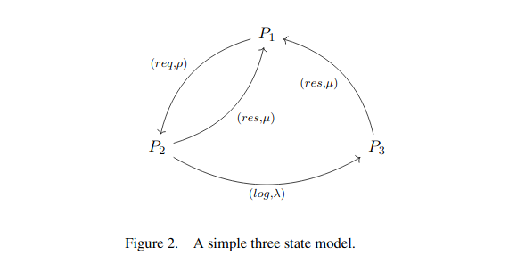
</center>

This example shows a CTMC (Continuous Time Markov Chain), it is possible to obtain
approximated DTMC from CTMC (see: Time discretization of Markov chains,
Bogdan Doytchinov and Rachel Irby) 

```{r, warning=F, message=F}
library(CIMICE) # import simple routines to define dtmc
library(expm)
# define rates (expected number of sent messages)
rho <- 20
mu <- 15
lambda <- 5

# Q: infinitesimal generator matrix (intensities)
# columns represent entering and exiting rates from a node
Q <- matrix(c(-rho, mu, mu, rho, -mu-lambda, 0, 0, lambda, -mu), ncol=3)
Q
# discretization t=1min.
t <- 1
P <- expm(t*Q)

DTMC <- cpmc(P=P, labels = list(c("user"),c("server"),c("auth_server")))
cpmc.normalize(DTMC)
DTMC$plot()
```


```{r, warning=F, message=F, results=F}
cat(DTMC$to.prism("test", initial=1, initial_state_description = c("user")))
```

<center>
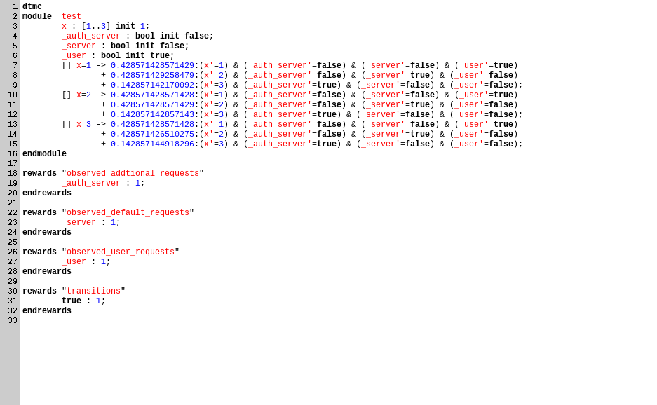
</center>

<center>
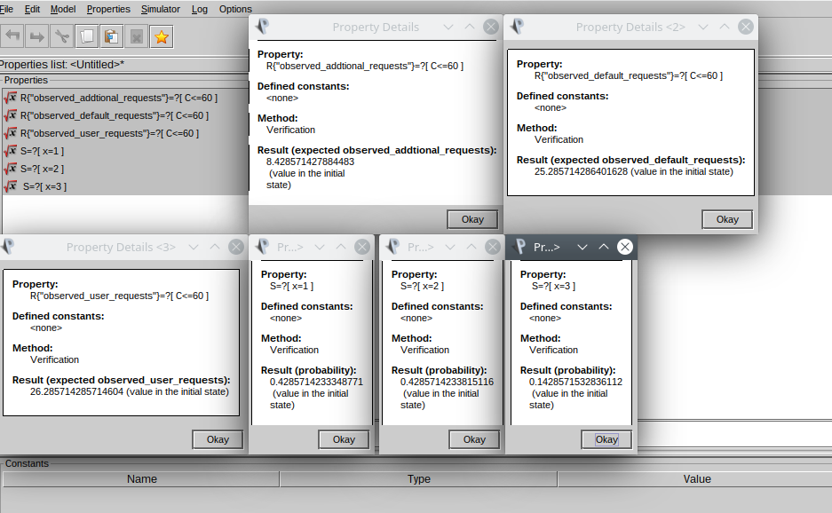
</center>

# Operating on DTMCs

## Reachability

It corresponds to the probability of reaching a certain state or state set ($T$)

$$ProbReach(s,T) = P_s(Reach(s,T)) = \{s_0...s_n... \in Path(s) | \exists s_i \in T\}$$

This probability is the generalized union of cylinder sets whose path $s_0...s_{m-1}s_m$ is simple (has no cycles) and s.t. 

$$\forall (s_0...s_{m-1})(s\notin T)  \mbox{   and   } s_m \in T$$

These sets are finite and for the closure property of $\sigma$-algebras $ProbReach(s,T)$ is measurable

# Probabilistic model checking

## Paths

**Paths** represent, as usual, **computations**:

* A path is an infinite sequence $s_{0}s_{1}...$ s.t. $P(s_i,s_{i+1})>0 \forall i \ge 0$

**Notation**:

* $Path(s)$: set of infinite paths starting from s
* $cyl(s_0...s_n)$: set og infinite paths starting with prefix $s_1...s_n$
  
## Probability measure over paths

A probability space is a triple $(\Omega, \Sigma, P)$:

* $\Sigma \subseteq 2^{\Omega}$ is a $\sigma$-algebra on $\Omega$ (a set closed under Negation, Union and Intersection)
* $P(\Omega)=1$
* $P(\cup_iE_i) = \sum_iP(E_i)$ (if $E_i$ are pairwise disjoint)
  
Theorem:

* For each $F\subseteq \Omega$, $\exists!$ minimal $\sigma$-algebra of $\Omega$ containing $F$.
  
## Probability space over paths

* $\Omega = Path(s)$
* $\Sigma_{Path(s)}$ = minimal $\sigma$-algebra containing $cyl(sp) \forall_{\mbox{finite}} p$

let $s$ be a state:

* $P_s(p) = 1$ if $p=s$
* $P_s(p) = P(s,s_1)P(s_1,s_2)...P(s_{n-1},s_{n}) \forall_{\mbox{finite}} p$

It is possible to use this definition to define a probability measure for Cylinder sets: 

$$P_s(cyl(p)) = P_s(p) \forall_{\mbox{finite}} p$$

## Computing Reachability

It is not always trivial to compute the generalized union of the cylinder sets.
A fixed point formulation of $ProbReach(T)$ lets possible to compute these probabilities for each state together:

$$y(s) = \begin{cases}
1 \mbox{  if  } s \in T,\\
\sum_{s'\in S}{P(s,s')y(s')}  \mbox{  else  }
\end{cases}$$

**Notes**:

* Recursion operates backwards from states in the target set $T$
* This definition adapts easily to compute bounded reachability

## Transient state prbability

How probable is to be in state $s'$ at time $t$?

$$\pi_{s,k}(s') = \sum_{s''\in S}{P(s'',s')\pi_{s,k-1}(s'')}$$

**Notes**:

* This computation is done in a "forward" fashion
* It is possible to compute these probabilities for each final state with simple vector per matrix multiplications:

$$\pi_{s,0}=0$$
$$\pi_{s,k}=\pi_{s,k-1}P$$

## Transient state probabilities in the long run

How probable is to be in a state if $k \rightarrow \inf$?

A major property of DTMC is that, if the number of states is **finite** and the chain is **irreducible** and **aperiodic**, 
it admits a unique limiting distribution for $\pi$, that is called **steady state**

The steady state $\pi$ is a probability distribution such that $\pi = \pi P$ and $\sum_{s\in S}\pi(s) = 1$

* **Irreducible**: composed by a single bottom SCC (so an SCC with no exit)
* **Aperiodic**: the GCD of times at wich state probabilities are greater than zero among the various states is 1.

In periodic DTMC it is possible to compute the mean "steady" state based on period length.

## Steady state on non transient DTMC

The computation relies on BSCC:

* Nodes $s'$ not in BSCC are said **transient** and have $\pi_s(s') = 0 \forall s$
* For the other nodes: $\pi_s(s') = ProbReach(s,T)x_T(s')$, where $x_T(s')$ is the steady state distribution 
  of the DTMC limited to the nodes in that specific BSCCs

## Qualitative properties

Qualitative properties have boolean outcome and can be evaluated by analyzing the **topology** of a DTMC.

**Repeated reachability** properties answer questions of the type ""always eventually ...", "... infinitely often". 

To check if states in a set $B$ are reached infinitely many times it suffice that:

$$\forall (T_{BSCC} \mbox{ reachable from } s_0)(T \cap B \ne \emptyset)$$

note that "... always eventually" is obtained by negation (not "infinitely often not ...").


## Persistance

These properties are of the kind "eventually forever..." that correspond to compute if
the computation always reaches a BSCCs containing only states that satisfies the required property.  

Formally, persistance of a set $B$ of states satifying a required property is valid iff:

$$T \subseteq B \forall T_{BSCC} \mbox{ reachable from } s_0$$

# Probabilistic Temporal Logics

## Probabilistic Temporal Logics

Temporal logics (TLs) are well fitted to model properties of systems that evolve as time flows.

Probabilistic temporal logics (PTLs) are a direct extension of TLs.
Transition diagrams for PTLs are augmented with **edges labelled with probabilities or rates**, like in the case **DTMCs**.

## PCTL

**PCTL** (Probabilistic Computation Tree Logic) is the probabilistic extension of **CTL**,
whose formulas are structured as follows:

**state formulae**:

$$\phi ::= \mbox{TRUE} | a |  \phi \land \phi |\lnot \phi|A \psi| E\psi$$

**path formulae**:

$$\psi ::= X\phi | F\phi | G\phi | \phi U \phi$$

Note that operators A,F and G are derivable form the others.

## CTL

In **CTL** temporal operators are the the following:

* **EFa**: It exists a path where $a$ holds sometime in the future
* **AFa**: In every path $a$ holds sometimes in the future
* **EGa**: It exists a path where $a$ always holds
* **AGa**: In every path $a$ always holds
* **EaUb**: It exists a path where $a$ holds continuosly until $b$ holds (and $b$ will hold in the future) 
* **AaUb**: In every path $a$ holds continuosly until $b$ holds (and it will in the future)
* **EXa**: It exists a transition to a state where $a$ holds
* **AXa**: Every transition from the current state leads to a state where $a$ holds

Note that these properties are evaluated in a specific state and paths represent the future as seen from that state.

## PCTL

PCTL extends CTL by adding the probabilistic operator:

$$P_{p\sim}[\psi]$$

(with $\psi$ path formulae, $\sim \in \{>,<,\ge,\le\}$ and $p \in [0,1]$)

"Given $s$ initial state, the probability that $\psi$ holds ($P(s,\psi)$) is such that $p\sim P(s,\psi)$ is true"

## Bounded Until

PCTL also include **bounded** version of the **until** operator:

$$\phi_1U^{\le k}\phi_2$$

That has the following semantics:

$$\omega \models \phi_1U^{\le k}\phi_2 \iff \exists (i \le k) (\omega(i) \models \phi_2 \land \forall (j< i)(\omega (j) \models \phi_1))$$
Note that:

* $F \equiv \mbox{true}U\phi$ and $F^{\le k} \equiv \mbox{true}U^{\le k}\phi$
* $\lnot P_{>p}[\psi] \equiv P_{\le p}[\psi]$

## Probabilistic reachability

* $P_{\sim p}[F \phi]$: reach a state where $\phi$ hold
* $P_{\sim p}[G \phi]$: $\phi$ holds forever 

(Also bounded version of these formulae are possible)

Of relevance is also that: $G \phi \equiv \lnot(F \lnot\phi)$

**Example**:

$$\lnot \mbox{oper} \rightarrow P_{\ge1}[F(P_{>0.99}[G^{\le 100}\mbox{oper}])]$$

## Measurability

All the sets of paths described by PCTL formulae are **measurable** as elements of $\Sigma_{path(s)}$ $\sigma$-algebra.

Recall that $\Sigma_{path(s)}$ is the union of cylinder sets with a finite path as prefix

**Proof sketch**:

* $X\phi$: cylinder with prefix of paths of length 1 whose state sataisfies $\phi$
* $\phi_1U^{\le k}\phi_2$: evaluation is on cylinder sets of length $\le k$
* $\phi_1U\phi_2$: countable union $\bigcup_{k\ge 1} \phi_1U^{\le k}\phi_2$

## Qualitative and Quantitative properties

* **Qualitative**: $P_{\sim p}[\psi]$ with $p=0 \lor p=1$
* **Quantitative**: $P_{\sim p}[\psi]$ with $p \in (0,1)$

Relevant equivalences and similarities:

* $P_{>0}[F\phi] \equiv EF \phi$
* $P_{>0}[F\phi] \cong EF \phi$

The last similarity is due to the fact that probability $\ge 1$ could be because of a limit to infinity

## LTL  with probabilities

PCTL is limited to compute probabilities of reaching a set of states by traversing only some
states in another set, in the long run or before $k$ steps. 

LTL syntax is the following: 

$$\psi ::= \mbox{true}|a|\lnot\psi|\psi_1 \land \psi_2| \psi_1 U \psi_2 | X \psi$$

LTL has therefore no separation between state and path formulae

LTL can also be extended with probabilities and can express different formulae from CTL:

  * LTL only: $F[\mbox{req} \land X \mbox{ack}]$ (in every future at a certain time a request is acknowledged)
  * CTL only: $AG EF \mbox{init}$ (can always return to the initial state)
  
This is because LTL always implicitly implies for all path quantification ($A$).
  
## Example:

$$LTL:F[\mbox{req} \land X \mbox{ack}] \mbox{  vs.  } CTL:AF[\mbox{req} \land AX \mbox{ack}]$$
<center>
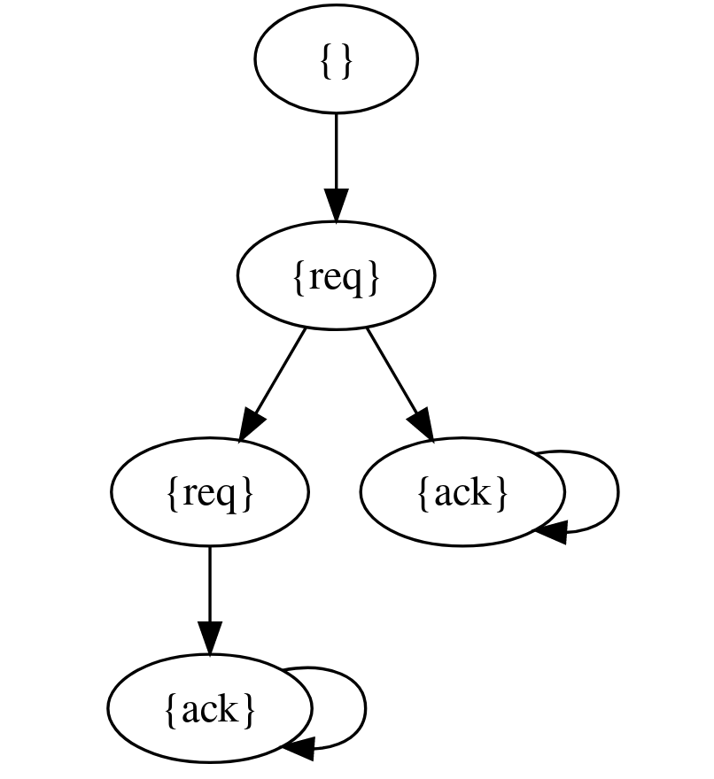{width=35%}
</center>

$$LTL:F[\mbox{req} \land X \mbox{ack}] \mbox{  vs.  } CTL:AF[\mbox{req} \land EX \mbox{ack}]$$

<center>
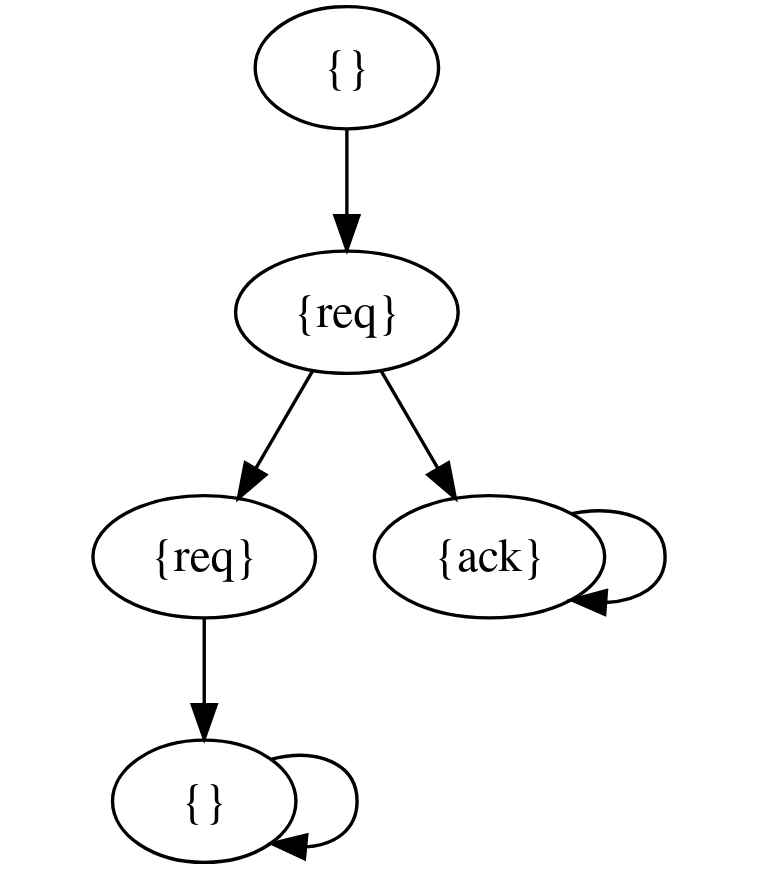{width=35%}
</center>
  
LTL focus on single computations while CTL takes all possible computation into account.
  
## PCTL*

PCTL* is more expressive than both PCTL and LTL. Differently from PCTL, the syntax is modified so 
that path formulae can produce state formulae:

* $\phi ::= \mbox{true}|a|\lnot\phi|\phi_1 \land \phi_2|P_{\sim p}[\psi]$
* $\psi ::= \phi|\psi \land \psi | \lnot \psi | \psi_1 U \psi_2 | X \psi$

# PCTL Model Checking on DTMCs

## PCTL Model Checking on DTMCs

* **Input**: $D_{DTMC}=(S,s_{init},P,L)$ and $\phi_{PCTL}$
* **Output**: $Sat(\phi)=\{s\in S | s \models \phi\}$

* **Formulae satisfaction**: $D_{DTMC} \models \phi$ if:
  - $s_{init} \models \phi$ 
  - alternatively if $\forall s . s \models phi$
  
(PRISM considers the first option)
  
## PCTL Model Checking on DTMCs 

The algorithm operates by induction on the parse tree of $\phi$

Non probabilistic cases:

* $Sat(true) = S$
* $Sat(a) = \{s\in S | a \in L(s)\}$
* $Sat(\lnot\phi) = S \setminus Sat(\phi)$
* $Sat(\phi_1\land\phi_2) = Sat(\phi_1) \cap Sat(\phi_2)$

## PCTL Model Checking on DTMCs

Probabilistic cases:

* We have a formula $P_{\sim p}[\psi]$ with $\sim \in \{>,<,\le,\ge\}$ and $k\in\mathbb{N}$ when considering bounded formulas
* These cases are based on the computation of $Prob(s,\psi)\forall s\in S$
* recall that $Sat(P_{\sim p}[\psi])=\{s\in S | Prob(s, \psi)\sim p\}$

Then the following cases are considered:

* **Next**: $P_{\sim p}[X\phi]$
* **Buonded until**: $P_{\sim p}[\phi_1 U^{\le k} \phi_2]$
* **Until**: $P_{\sim p}[\phi_1 U \phi_2]$

## Next

* $Sat(P_{\sim p}[X\phi]) = \{ s \in S | Prob(s, X\phi) \sim p\}$

we have that: 

$$Prob(s,X\phi) = \sum_{s'\in Sat(\phi)}{P(s,s')}$$

This corresponds to summing the probability of reaching from a node another in which $\phi$ holds.

It is quite easy to see that:

$$ Prob(X \phi)=P\phi$$

Where $\phi$ is the boolean vector of nodes sataisfing $\phi$. So it is possible to evaluate the "Next" operator 
with a single matrix-vector multiplication.

## Example

On the following DTMC:

```{r}
P <- matrix(
  c(
    0, 1, 0, 0, 
    0, 0.01, 0.01, 0.98,
    1, 0, 0, 0,
    0, 0, 0, 1
  ),
  nrow=4, byrow=TRUE)
labels <- c("s0:{}", "s1:{try}", "s2:{fail}", "s3:{succ}")
```

```{r, echo=FALSE, warning=F, message=F}
print_DTMC <- function(P, labels){
  g <- graph_from_adjacency_matrix(P, weighted = TRUE) %>%
    as_tbl_graph()
  g$labels <- labels
  
  ggraph(g) + theme_bw() +
    geom_node_point(aes(color=as.factor(labels)), size = 10) +
    geom_edge_loop(aes(alpha = log(E(g)$weight), 
                       label = round(E(g)$weight, 3)), 
                   end_cap = circle(10, 'mm'), 
                   start_cap = circle(10, 'mm'), 
                   angle_calc = 'along',
                   label_dodge = unit(2.5, 'mm'),
                   repel = T, color="red", arrow = arrow(length = unit(4, 'mm'))) +
    geom_edge_link(aes(alpha = log(E(g)$weight),
                       label = round(E(g)$weight, 3)),
                       end_cap = circle(10, 'mm'), 
                       angle_calc = 'along',
                       label_dodge = unit(2.5, 'mm'),
                       start_cap = circle(10, 'mm'), 
                   repel = T, color="red", arrow = arrow(length = unit(4, 'mm'))) +
    geom_node_label(aes(label = labels), repel = T) + 
    theme(legend.position = "none") 
}
```

```{r, warning=F, message=F}
print_DTMC(P,labels)
```

Check: $$P_{\ge0.9}[X(\lnot try \lor succ )]$$

```{r}
# the inner formula holds in the following states
phi <- c(1, 0, 1, 1)
```

```{r}
# NEXT
p_ <- P %*% phi 
c(t(p_))
```

```{r}
# Apply comparison
map_lgl(p_, ~ ifelse(. >= 0.99, TRUE, FALSE))
```


## Bounded Until

* $$Prob(s,\phi_1 U^{\le k} \phi_2) = \{ s \in S | Prob(s, \phi_1 U^{\le k} \phi_2) \sim p\}$$

We define these auxiliary sets:

* $S^{yes} = Sat(\phi_2)$: In this set the until formula is satisfied
* $S^{no} = S \setminus (Sat(\phi_1) \cup Sat(\phi_2))$: in this set the until formula is not satisfied
* $S^{?} = S \setminus (S^{yes} \cup S^{no})$: in this set it is not certain if the until formula is satisfied

## Bounded Until

The bounded until probabilities are now computed by the following formula:

$$Prob(s,\phi_1 U^{\le k} \phi_2) = \cases{1 \mbox{  if  } s\in S^{yes}\\
0 \mbox{  if  } s\in S^{no}\\
0 \mbox{  if  } s\in S^{?} \land k=0\\
\sum_{s' \in S}{P(s,s')Prob(s,\phi_1 U^{\le k-1} \phi_2)}}$$


This computation behaves similarly to the "Next" operator one. Probabilities are backpropagated for $k$ steps 
from the $S^{yes}$ set. This computation requires $k$ matrix-vector multiplications.

## Example

```{r}
print_DTMC(P,labels)
```

Check: $$P_{>0.98}[F^{\le2}succ] \equiv P_{>0.98}[trueU^{\le2}succ]$$

$Sat(true) = S$, $Sat(succ) = s_3$, $S^{yes} =\{s_3\}$, $S^{no} = \emptyset$ and $P'=P$ (in this specific example)

```{r}
# states in which succ (or true Until(<=0) succ) holds
p_ = c(0,0,0,1)
# k=1
p_ <- P %*% p_
c(t(p_))
# k=2
p_ <- P %*% p_
c(t(p_))
```

```{r}
# Apply comparison
map_lgl(p_, ~ ifelse(. > 0.98, TRUE, FALSE))
```

## Until

In this case in not possible to "simulate" the computation on the DTMC. 

We define some auxiliary sets as follows:

* $S^{yes} = Sat(P_{\le1}[\phi_1 \cup \phi_2])$
* $S^{no} = Sat(P_{\le0}[\phi_1 \cup \phi_2])$

To compute these sets auxiliary functions $\texttt{Prob0}$ and $\texttt{Prob1}$.

## Prob0

This algorithm computes $S^{no} = Sat(P_{\le0}[\phi_1 U \phi_2])$

The following equivalence is here relevant:

$$Sat(P_{\color{red}{>}0}[\phi_1 U \phi_2]) = Sat(E(\phi_1 U \phi_2)) $$

These are the states that can reach $\phi_2$ satisfying states by only trepassing $\phi_1$ satisfying states.

Finally $S^{no}$ is obtained by difference with $S$.

## Prob0 pseudocode

This is basically a visit of the graph:

```
Prob0(Sat(phi_1), Sat(phi_2)){
  R <- Sat(phi_2)
  while(true){
    # backtracking form Sat(phi_1) elements
    R' <- R U {s in Sat(phi_1) | Exists(s' in R, P(s,s')>0)}
    # check if this is the fixed point
    if(R'==R)
      break
    R <- R'
  }
}
```


## Prob1

This algorithm computes $S^{yes} = Sat(P_{\le1}[\phi_1 \cup \phi_2])$

In this case $Sat(P_{\color{red}{\lt} 1}[\phi_1 U \phi_2])$ is computed end $S^{yes}$ is obtained by difference as before.
This consist in finding the states that can reach elements in $S^{no}$:

```
Prob1(Sat(phi_1), Sat(phi_2), S_no){
  R <- S_no
  while(true){
    # backtracking
    R' <- R U {s in (Sat(phi_1) \ Sat(phi_2))| Exists s' in R . P(s,s')>0 }
    # fixed point
    if (R' == R)
      break
    R <- R'
  }
}
```

## PCTl until system of equation

Now we have that:

$$Prob(s, \phi_1 U \phi_2) = \cases{ 1 \mbox{  if  } s \in S^{yes} \\ 
  0 \mbox{  if  } s \in S^{no} \\
  \sum{s' \in S}{P(s,s')Prob(s', \phi_1 U \phi_2)} \mbox{  otherwise} }$$
  
Note that this definition also permits to optimize the problem so that this system has only $|S^{?}|$ unknows,
instead of $|S|$. 

To solve this system of equations many approaches are available in the litterature.

## Example

```{r}
P <- matrix(c(
   0, 0.1, 0.9, 0, 0, 0,
   0.4, 0, 0, 0.6, 0, 0, 
   0, 0, 0.1, 0.1, 0.5, 0.3,
   0, 0, 0, 1, 0, 0,
   0, 0, 0, 0, 1, 0,
   0, 0, 0, 0, 0.7, 0.3
  ), ncol = 6, byrow = TRUE
)
labels <- c("s0:{}", "s1:{a}", "s2:{}", 
            "s3:{a}", "s4:{b}", "s5:{b}")
```

```{r, warning = F, message=F}
print_DTMC(P,labels)
```

**Check**: $P_{>0.8}[\lnot a U b]$

$\texttt{Prob0}$: compute

$$S^{no} = S \setminus Sat(P_{>0}[\lnot a U b]) = S \setminus \{s_0, s_2, s_4, s_5\} = \{s_1, s_3\}$$

(reach $b$ passing only by $\lnot a$)

$\texttt{Prob1}$: compute 

$$S^{yes} = S \setminus Sat(P_{<1}[\lnot a U b]) = S \setminus \{s_0, s_2, s_1, s_3\} = \{s_4, s_5\}$$

(reach $S^{no}$ by passing only by $\lnot a$)

**Linear system of equations**:

* $s_1 = s_3 = 0$ ($S^{no}$)
* $s_4 = s_5 = 1$ ($S^{yes}$)
* $x_2 = 0.1x_2+0.1x_3+0.5x_4+0.3x_5$
* $x_0 = 0.1x_1+0.9x_2$

```{r}
# linear system of equations
A <- matrix(c(
  1, -0.1, -0.9, 0, 0, 0,
  0, 1, 0, 0, 0, 0,
  0, 0, 0.9, -0.1, -0.5, -0.3,
  0, 0, 0, 1, 0, 0,
  0, 0, 0, 0, 1, 0,
  0, 0, 0, 0, 0, 1
), ncol = 6, byrow = TRUE)

b <- c(0, 0, 0, 0, 1, 1)
# solve
p_ <- solve(A, b)
p_
```

```{r}
# Apply comparison
map_lgl(p_, ~ ifelse(. > 0.8, TRUE, FALSE))
```


## Summary and complexity

PCTL model checking on DTMCs is:

* linear in the length of the PCTL property $|\phi_{PCTL}|$
* polynomial in the number of states $|S|$

Different operators have different computational cost; $P_{\sim p}[\phi_1 U \phi_2]$ is the 
heaviest because of the linear equations system resolution algorithm. This is in fact 
$O(|S|^3)$ with the **Gaussian elimination algorithm**, but there exists faster methods.

Note that bounded formula depend on the bound $k$ for their complexity ($O(|S^2|k)$) but this number is
usually small in real applications.

# Costs and Rewards

## Costs and Rewards

It is possible to augment the considered temporal logics with the capability to
track costs and rewards. 

Of costs and reward it is possible to compute:

* expected value
* minimum value
* maximum value

## Rewards

Costs and rewards can be modelled in the same way, so we will refer to the term rewards only.

Rewards can seen as labels and are divided in two types:

* **State rewards**: $\rho: S \rightarrow \mathbb{R}_{\ge0}$
* **transition rewards**: $l : S\times S \rightarrow \mathbb{R}_{\ge0}$

This allows to evaluate properties on both states and transitions, for **example**:

* "Size of message queue at time k": count number of modules in "queue" (label 1 to "queue" nodes)
* "Total number of time steps": cumulate undertaken transitions (label 1 to each transition)

## Expected reward properties

* **Istantaneous**: E["reward at time $k$"]
* **Cumulative**: E["cumulated value at time $k$"]
* **Reachability**: E["cumulated value before reaching a certain state"] (eg.: "expected time for algorithm termination")

Recall that:

$$ E[X] =_{discrete} \sum_{\omega \in \Omega}{X(\omega)P(\omega)} =_{continuos} \int_{\omega \in \Omega} X(\omega)dP$$

## Computing rewards

In order to compute expected values for rewards, by the definition of expected values, it suffice to perform the weighted sum of the
rewards as follows:

$$ ExpReach(s,T) = \cases{
\infty \mbox{  if  } ProbReach(s,T) < 1 \\
0 \mbox{  if  } s \in T \\
\rho(s) + \sum_{s'\in S}{P(s,s')(l(s,s')+ExpReach(s',T))}
} $$
 
This leads to a system of equations that can be solved as usual.

## Specifying rewards properties

The following operators are added:

* **instantaneous reward**: $R_{\sim r}[I^{=k}]$ (compute rewards at time $k$)
* **cumulative reward**: $R_{\sim r}[C^{\le k}]$ (compute cumulative rewards up to time $k$)
* **reachability reward**: $R_{\sim r}[F\phi]$ (the expected value of the reward before reaching states where
$\phi$ holds is ...)

The first two are computed by simulation while the latter by solving the previously presented linear equations system.
(it is possible, like with $P$ operators, to query for the exact value by defining the $R_{=?}$ operator)

## Counterexamples

Counterexample generation is one of the strengths of model checking. This typically consists in generating a trace
of states and transitions such that the tested logical formula is not satisfied.

In the case of DTMCs, counterexamples must be redefined to cope with probabilities.
In this context a **trace** is no longer a path but a set of them.

Consider $P_{<0.01}[F{err}]$ "the system reaches err with probability less than 0.01", to 
create a counter example it is necessary to define a set of paths that cumulate a probability 
of reaching err of more than 0.01.

We can define these counter examples as set of paths:

## Example

```{r, warning=F, message=F}
P <- matrix(c(
  0,0.6,0,0.1,0.3,0,
  0,0,1/3,0,2/3,0,
  0,0,0,0,0.3,0.7,
  0,0,0,1,0,0,
  0,0,0.5,0,0.2,0.3,
  0,0,0,0,0,1
), ncol = 6, byrow = T)
labels <- c("s0:{}","s1:{}","s2:{b}",
            "s3:{}","s4:{}","s5:{b}")
print_DTMC(P, labels)
```

Check: $P_{\le 1/2}[F b]$ for $s_0$

* $Prob(s_0, Fb) = 0.9$

consider the following sets of paths:

* $C_1=\{s_0s_1s_2, s_0s_1s_4s_2, s_0s_1s_4s_5, s_0s_4s_2\}$, $P(C_3)=0,67$ (not minimal)
* $C_2=\{s_0s_1s_2, s_0s_1s_4s_2, s_0s_1s_4s_5 \}$, $P(C_3)=0.52$ (minimal)
* $C_3=\{s_0s_1s_2, s_0s_1s_4s_2, s_0s_4s_2\}$, $P(C_3)=0.55$ (smallest: minimal of maximum probability)

## Notes on counterexamples

For "bounded until" formulae the number of elements in the counterexample set is always finite.
With other operators (like $P_{< p}[Fa]$) the number of elements in the set could be infinite
  (as probabilities are computed with $k \rightarrow \infty$)

We would like to find a minimal counter example set with the highest probability (**strongest evidence**)

**Algorithm**:

* the DTMC is modified so that: $\lnot \phi_1 \land \lnot \phi_2$ satisfying sets become absorbing, a state $t$ is added and
    every state sataisfying $\phi_2$ is added a transition to it.
* the DTMC is converted to a weighted directed acyclic graph with weights $w(s,s') = log(\frac{1}{P(s,s')})$
* Finally the following property is fundamental (for paths with same source and destination):
  
$$\forall(\omega, \omega')(P_s(\omega')\ge P_s(\omega) \iff d(\omega')\le d(\omega))$$
  
* In the case of **bounded until** minimum paths of length $k$ are computed
* With **unbounded until** pairwise minimum paths are computed
* Both problem can be solved with the **Floyd-Warshall** algorithm

## Bisimulation

Two models are bisimilar ($\sim$) when their branching structure is equal. 

It can be shown that:

$$s \sim s' \iff \forall \phi_{PCTL}(s \models \phi_{PCTL} \iff s' \models \phi_{PCTL})$$

This holds also of $PCTL^*$ formulae. 

This means we can optimize $PCTL^*$ model checking by finding the minimal bisimilar model to the original DTMC:

The algorithm starts with an initial partitioning like dividing states by labels:

$$\Pi = \{\{s \in S | L(s) = \mbox{lab}\} | \mbox{lab}\in 2^{AP}\}$$

Then a **T splitter** for a block $B \in \Pi$ is found. This is a block such that the probability of reaching 
a node in $T$ from nodes in $B$ differs:

$$\exists s, s'\in B . P(s,T) \ne P(s',T)$$
Finally $B$ is splitted accordingly. This process is repeated until there are no more $T$-splitters.

# $\omega$-regular properties

## $\omega$-regular properties

With $\omega$-regular properties it is possible to consider infinite paths and so to model fairness and liveness properties.

* Recall $\omega$-regular expression: 

$$E ::= \emptyset|\varepsilon|\alpha\in \Sigma| E+E| E.E | E^*$$
$$G = E_1.(E'_1)^{\omega} + \dots + E_n.(E'_n)^{\omega}$$

It is possible to construct these properties using the atomic propositions $AP$, labels of the DTMCs. A path $\omega$ satisfies $P$
if $trace(\omega) \in P$ (with $P \subseteq (2^{AP})^{\omega}$).

For example $((\lnot \mbox{succ})^*.\mbox{succ})^{\omega}$ models a computation where $succ$ happens infinitely often.

## Rabin automata

Recall that a *Deterministic Rabin Automata* (DRA) is a quintuple $A=(Q,\Sigma, \delta, q_0, Acc)$ where:

* $Q$ is the set of states
* $\Sigma$ is the alphabet
* $\delta$ is a deterministic transition function
* $q_0$ is the initial state
* $Acc \subseteq 2^Q\times 2^Q$ is the set of accepting pairs that defines the acceptance condition: $(L_i,K_i)$

A computation on a DRA is accepted if there exists a pair $(l_i,k_i)$ with $l_i\in L_i \land k_i \in K_i$ such that the 
computation traverses finitely many times states in $l_i$ and infinitely many times for the states in $k_i$. Note, for example,
that a Deterministic Büchi Automata is equivalent to a DRA with $Acc=\{\emptyset,\{F\}\}$.

## Apply DRA to DTMC

DRA can express $\omega$-regular properties that can be evaluated on DTMCs.

Let $A$ be a DRA on $2^{AP}$, D be a DTMC and 

$$Prob^D(s,A) = P_s^D(\{\omega \in Path(s) | trace(\omega) \in L(A)\})$$

It is possible to evaluate $Prob^D(s,A)$ by constructing a product DTMC of $A$ and $D$. 

That DTMC is $D \otimes A := (S \times Q, (s_{init},q_{init}), P', L')$ where

* $q_{init} = \delta(q_0,L(s_{init}))$ (start from initial state atomic propositions)
* $P'((s_1,q_1),(s_2,q_2)) = \cases{P(s_1,s_2) \mbox{  if  } q_2=\delta(q_1, L(s_2)) \\ 0 \mbox{  else} }$ 
  (keep transition only when possible)
* $l_i \in L'(s,q)$ if $q \in L_i$ and $k_i \in L'(s,q)$ if $q \in K_i$
  (accepting states become labels to keep track of traversed states)
  
Finally $Prob^D(s,A) = Prob^{D \otimes A}((s,q_s), \bigvee_{i\in 1..k}(FG\lnot l_i \land GF k_i))$ (FG: finally forever, GF: globally finally) 

## LTL model checking

The operations for LTL model checking can so be described as follows:

1. Generate the DRA $A$ for the LTL formula $P_{\sim p}[\psi]$
2. Build the DTMC $D \otimes A$
3. Identify accepting BSCC in $D \otimes A$
4. Compute $ProbReach$ as seen for PCTL (the probability of reaching accepting BSCC from all nodes)
5. Compare probabilities for $(s,q_s)$ against $p$ for all $s$ (if the property is qualitative)

## Measurability

$\forall \psi$ $\omega$-regular formula, the set of $\psi$-sataisfing paths on $D$ is measurable

Proof sketch:

$\omega$-regular languages can be converted to DRA, and $D \otimes A$ maps $\omega$-paths so that:

$$\omega \models \psi \iff \omega' \models \bigvee_{i\in 1..k}(FG\lnot l_i \land GF k_i)$$
Being $FG\phi$ and $GF\phi$ measurable (by previous proofs), $\sigma$-algebras are closed under union and intersection, therefore
the whole formula is measurable.

## Complexity

Model checking of a formula $\phi_{LTL}$ on $D_{DTMC}$ is:

* **doubly exponential** (actually exponential only) on $|\phi_{LTL}|$ due to the conversion to DRA
* **polynomial** in $|D_{DTMC}|$ due to the computation of the **Tarjan-Harel** algorithm for BSCC and because of the resolution of linear systems of equations

In actual application $|\phi_{LTL}|$ is rather small while $|D_{DTMC}|$ quite large.

## PCTL* Adaptation

The approach is similar to that of LTL (recall that $\phi$ are state formulae while $\psi$ are path formulae):

* The PCTL* formula is parsed bottom up 
* In the case of $P_{\sim p}[\psi]$ (new cases):
  * maximal state formulae are replaced by atomic propositions (these formulae will be model checked recursively)
  * the resulting formula is an LTL formula and can be model checked as seen in the previous slides
* In other cases operations follow PCTL model checking


# An application in Bioinformatics

## CIMICE: 

### **(Markov) Chain Method To Inferr Cancer Evolution**

CIMICE is a tool in the field of **tumor philogenetics** (or **cancer progression**)
with the goal of describing the relation between **genotypes** in a specific context:

* single-cell sequencing
* partial infinite site assumption holds
* mutations are limited to INDELS

The **input** data of CIMICE is a mutational matrix, that describes for each sample the
genes that were observed as mutated compared to a certain reference (usually 
normal cells from the same patient)

The **output** is a DTMC (that we also call CPMC, Cancer Progression Markov Chain)
that has a DAG topology (except for sink states, that have a self loop with probability
one). Each node og this DTMC is labelled with a genotype, a list of mutated genes. 

**GitHub**: https://github.com/redsnic/CIMICE

## Enriching CIMICE's output

The DTMC constructed by CIMICE has a very simple topology, the steady state
distribution in very easy to compute and should describe how cancer cells
are expected to divide in the many different tumor subtypes. 

With the development of cancer treatments, it would be quite of interest 
to adapt these models to account for drug effects.

In a first approach to this topic we considered **two** very simple options:

* Drug that are lethal for certain cellular subtypes (those are quite common)
* Drug that induce a mutation in the target cancer cell, adding or removing alterations

## Defining treatment effects

A lexer-parser pair was written, in order to define a simple language
to make easier the definition of such drug effects. Consider the following
example.

```
# --- Treatment description file --- 
# (comment lines start with '#')
# Format:
#
# drugName {
#   [guard] action action_params;
#   [guard] kill efficacy;
#   [guard] mutate [ Gene1, -Gene2, ... ] efficacy; # "-Gene" means remove Gene 
# }
#
# drugName2 { ... }
# ...
#
# Syntax of guards 
# (they describe the genotype necessary to apply the effects of the drug)
#                 not      and             or
# guard := GENE ; - GENE ; guard & guard ; guard | guard ; ( guard )  

firstDrug { 
    [AAA | BBB] kill 0.9;
} 
 
secondDrug {
    [(AAA & BBB) | CCC] mutate [AAA,-BBB] 0.5; 
    [ccc] kill 0.2;
}

simpleTest{
    [D] mutate [-D,B] 0.5;
    [A] kill 0.5;
    [A & D] kill 1;
}
```

## Effect application and DTMC alteration

The application of the effect of the drugs is made effect by effect
following the definition order for the selected treatment.

**Kill** effects are applied on all the nodes of the DTMC whose labels satisfy
the guard and is implemented by adding a new **sink** node representing 
the cells killed by the application of treatments. An edge of the given
probability will connect the target node with this sink node.

**Mutate** effects are slightly more complex, when a node satisfy the 
guard its label is modified as described by the rule. If a node 
with that label does not exist, it is created. The target node will 
point to this node with the given probability.

## An example

Here is a full working example on how to create a PRISM model form CIMCE:

```{r, message = F, warning=F}
library(CIMICE)
# CIMICE input dataset
example.dataset()
# run CIMICE analysis
cimice.out <- quick.run(example.dataset())
# build a DTMC from CIMICE's output
DTMC <- to.cpmc(cimice.out$topology, cimice.out$weights, cimice.out$labels)
# plot current DTMC
DTMC$plot()
# read treatment file (it is the one from the previous example)
treatments <- load.treatments("/home/redsnic/git/CIMICE/inst/extdata/test.treatments")
# apply a treatment
cpmc.apply.treatment(DTMC, "simpleTest", treatments)
# plot again
DTMC$plot()
# remove not reachable nodes
cpmc.prune(DTMC, label="Clonal")
# plot again
DTMC$plot()
```


```{r, message = F, results=F}
# create prism model
cat(DTMC$to.prism("testModel"))
```

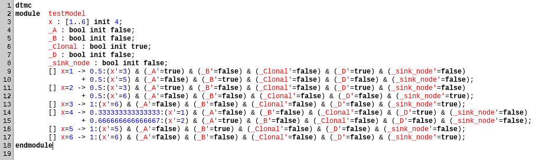

## Evaluating properties with PRIMS

Consider the following DTMC:

```{r, include = F, warning=F}
cimice.out <- quick.run(example.dataset())
DTMC <- to.cpmc(cimice.out$topology, cimice.out$weights, cimice.out$labels)
treatments <- load.treatments("/home/redsnic/git/CIMICE/inst/extdata/test.treatments")
cpmc.apply.treatment(DTMC, "simpleTest2", treatments)
cpmc.prune(DTMC, label="Clonal")
```

```{r, warning=F, message=F}
DTMC$plot()
```

```{r, results=F}
cat(DTMC$to.prism("test2"))
```

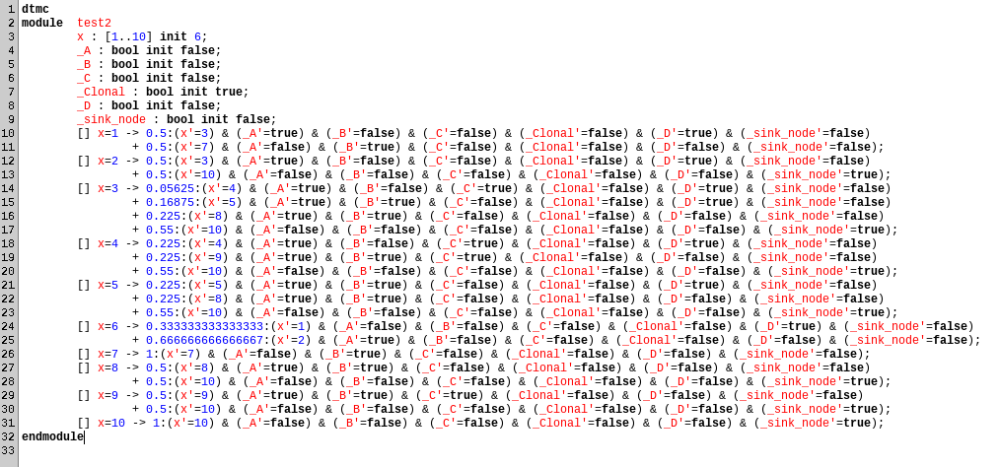
**Steady States Probabilities**:

```
Printing steady-state probabilities in plain text format below:
6:(7,false,true,false,false,false,false)=0.16666666666666666
9:(10,false,false,false,false,false,true)=0.8333333333333336

Time for steady-state probability computation: 0.003 seconds.
```

This means that 83\% of the cancer cell are eventually expected to be killed by
the drug while the remaining 17\% will continue proliferating and will carry
a mutation on the gene B.

Even if this is just a toy model, this kind of analysis could be useful 
in the efforts to lead the tumor to less aggressive subtypes and so to
better prognosis in patients. The analysis of temporal logic formulae 
before and after treatment effects can be used also to track unexpected
tumor subtypes that could be more resistant to treatments.

## Future plans

The current implementation of treatments is just a starting point. The first 
relevant aspect is to have better flexibility on how drug effect are **combined**.
In this specific case two options are of interest:

* **subsequent application**: effects are applied one after another (implemented)
* **simultaneous application**: effect are combined and applied together

The second point requires to define some assumption about drug interaction and their
degree of independence. The syntax of the drug description language should be modified
accordingly to simplify the definition of this kind of behaviors.

Utilities to easily compare the resulting DTMC are also needed as with a 
improved PRIMS integration.

## References

* **PRIMS**: https://www.prismmodelchecker.org/
* **Lectures**: https://www.prismmodelchecker.org/lectures/pmc/
* **Publications**: https://www.prismmodelchecker.org/publ-selected.php
* **CTMC Discretization**: https://www.jstor.org/stable/24340803?seq=1
* **CIMICE**: https://github.com/redsnic/CIMICE
* **Simple examples**: https://arxiv.org/pdf/1808.08650.pdf 


